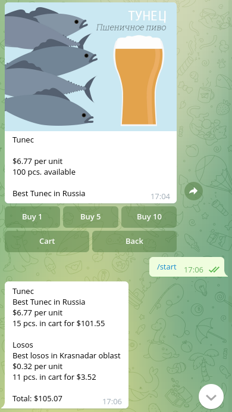

# Fish store bot

Проект предназначен для продажи рыбы через чат бота.
Пример:
- `@fish_market98897_bot`




### Как установить

Создайте файл `.env` со следующими переменными:

- `TG_BOT_TOKEN` — токен телеграм бота.
- `DATABASE_HOST` — хост от базы данных Redis.
- `DATABASE_PORT` — порт от базы данных Redis.
- `DATABASE_PASSWORD` — пароль от базы данных Redis.
- `MOLTIN_CLIENT_ID` - Client ID из API [elasticpath](https://euwest.cm.elasticpath.com/).


Python3 должен быть уже установлен. 
Затем используйте `pip` (или `pip3`, если есть конфликт с Python2) для установки зависимостей:
```
pip install -r requirements.txt
```

Чтобы запустить бота, необходимо выполнить команду:
```
python3 bot.py
```

### Цель проекта

Код написан в образовательных целях на онлайн-курсе для веб-разработчиков [dvmn.org](https://dvmn.org/).